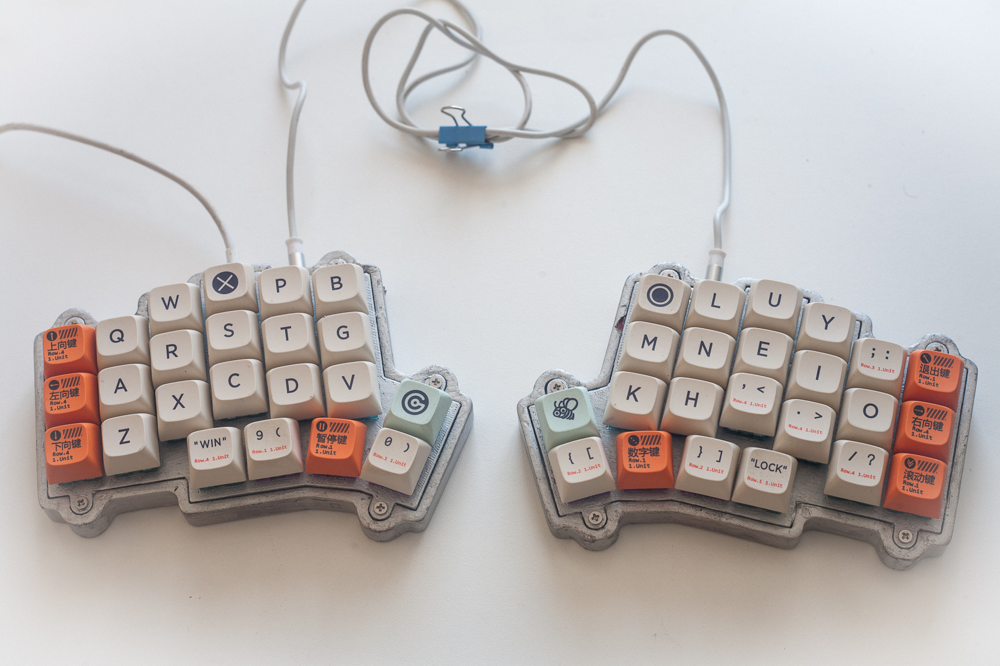
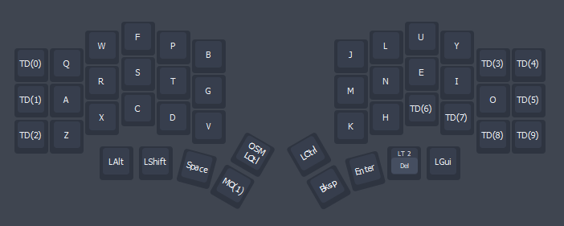

# VOID Ergo S

VIAL configuration for [Victor Lucachi](https://github.com/victorlucachi/qmk_firmware/tree/dev_void/keyboards/handwired/void_ergo)'s Void Ergo keyboard.

 - VIAL unlock is the top left key on the left hand side and the top right key on the right hand side.
 - Rotary encoders disabled because I am not using them on my build.
 - Tri-state layer (`Layer 1` + `Layer 2` = `Layer 3`) disabled due to personal preference.
 - `config.h` fixed from 8x12 to 8×6 in order to work with VIA/VIAL. 
 - Compiled `.hex` is available in the root directory for convenience.
 - [Super ALT↯TAB](https://docs.qmk.fm/#/feature_macros?id=super-alt%e2%86%aftab) implemented and bound to `USER00` and `USER01` for `Alt-Shift-Tab` (left) and `Alt-Tab (right)` respectively.
 - Current `.vil` VIAL keymap stored in the `keymaps\vial` folder 

## Current Keymap

Still trying to figure out something that works for me.

